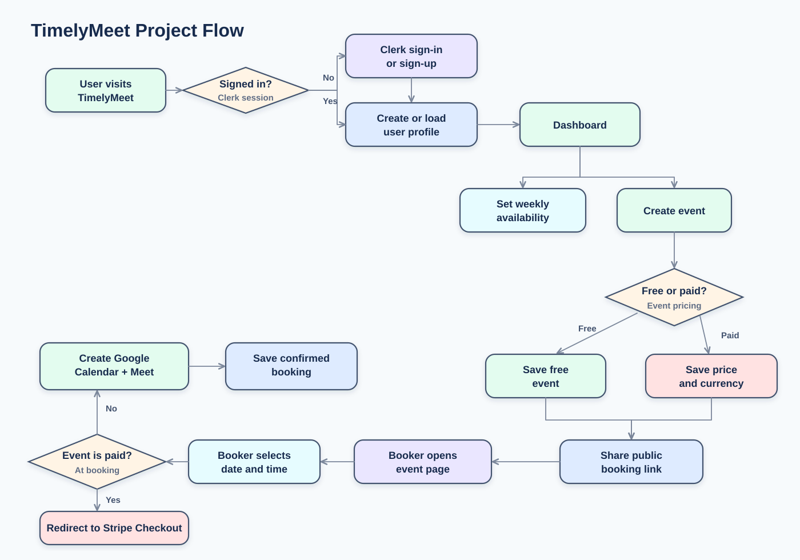
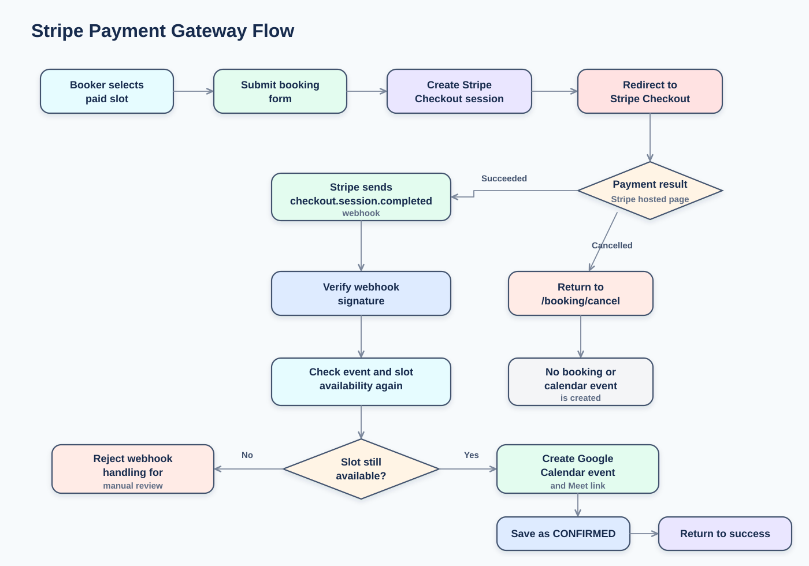
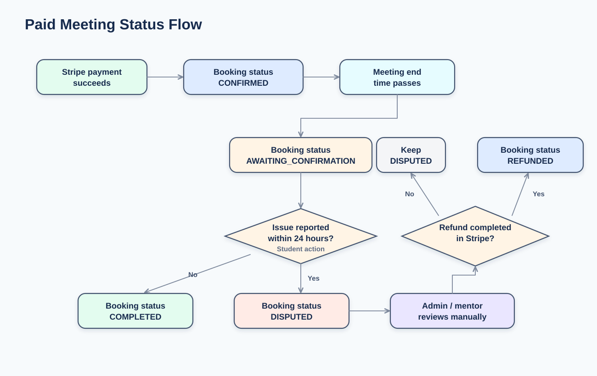
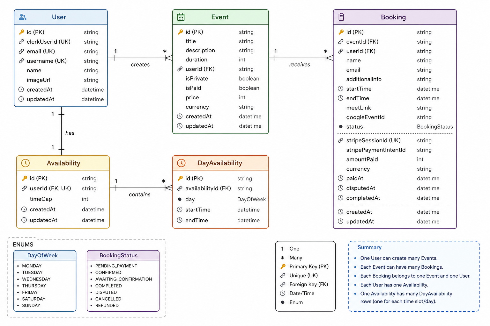

# **Check Out Live**

https://timelymeet.vercel.app/

# **TimelyMeet**

TimelyMeet is a responsive web application designed to streamline scheduling and appointment booking. It integrates Google Calendar API, Prisma for the database, and Clerk for authentication, allowing users to create events, share event links, and check available times for convenient scheduling.

## **What Problem It Solves**

- **Students connecting with experienced people** — Anyone looking for guidance — whether for a resume review, mock interview, or career advice — can browse a professional's available slots and book a session directly. Once confirmed, an automated meeting link is sent to both parties — no back-and-forth DMs required.
- **Event-based mentorship and group sessions** — Organizers can set up booking slots for experts and let participants self-schedule their time. Everyone gets automated confirmations, so no one has to manually coordinate or follow up.
- **Communities and groups managing scheduled sessions** — Whether it's a club, a team, or an online community, shared booking links make it easy to organize sessions at scale without spreadsheets, forms, or message threads.

---

## **Features**

- **Responsive Design**: Works seamlessly on desktop and mobile devices.
- **Authentication**: User authentication powered by Clerk, ensuring secure login and user management.
- **Google Calendar Integration**: Users can sync their Google Calendar to create events and manage availability.
- **Event Scheduling**: Users can create events, share event links, and allow others to view available time slots.
- **Appointment Booking**: Recipients can view the user's available time and schedule appointments directly.
- **Paid Bookings**: Event creators can make events free or paid. Paid bookings use Stripe Checkout.
- **Booking Status Flow**: Paid meetings can be confirmed, completed, disputed, cancelled, or marked refunded after manual review.

---

## **Technologies Used**

- **Frontend**: React, JavaScript, HTML, CSS
- **Backend**: Next.js server actions
- **Authentication**: Clerk
- **Calendar Integration**: Google Calendar API
- **Database**: Prisma (for database interaction)
- **Payments**: Stripe Checkout, Stripe webhooks, and Stripe Connect payouts

---

## **Project Flow**

TimelyMeet has two main users:

- **Event creator / mentor**: signs in, sets availability, creates event types, and shares booking links.
- **Booker / student**: opens a public booking link, selects a slot, and books a meeting.



### **Main App Areas**

- `/dashboard`: account overview and public username link.
- `/availability`: weekly availability setup.
- `/events`: event list and event creation.
- `/meetings`: upcoming and past meetings, cancellation, completion, dispute, and refund status controls.
- `/[username]`: public profile with public events.
- `/[username]/[eventId]`: public booking page.

---

## **Payment Gateway Flow**

Paid bookings use Stripe Checkout. The app does not store card details and does not trust the browser redirect as proof of payment. A paid booking is confirmed only after Stripe sends a verified webhook.



### **Paid Meeting Status Flow**



### **Entity Relation Ship Diagram**



### **Payment Notes**

- Stripe money goes to the platform Stripe account.
- Mentors can connect a Stripe Express account when `STRIPE_CONNECT_ENABLED=true`.
- TimelyMeet stores the platform fee and mentor payout amount when a paid booking is confirmed.
- After a paid meeting is completed, TimelyMeet creates an idempotent Stripe transfer to the mentor's connected account.
- In production, Stripe Connect can be disabled with manual payouts while Stripe account/country eligibility is pending.
- `STRIPE_PLATFORM_FEE_PERCENT` controls the platform commission. If it is not set, TimelyMeet uses 10%.
- Refunds are manual in Stripe Dashboard.
- After a manual refund, the booking can be marked `REFUNDED` in TimelyMeet.
- Student issue reporting is available from the paid booking success link during the 24-hour post-meeting window.
- The booking page shows the policy: full refund if the mentor cancels or does not attend, and issues must be reported within 24 hours after the meeting.

---

## **Deployment**

The production app is deployed on Vercel:

https://timelymeet.vercel.app/

Vercel should use the default Next.js settings:

- **Install Command**: `npm install`
- **Build Command**: `npx prisma migrate deploy && npm run build`
- **Output Directory**: `.next`

Required production environment variables:

```env
DATABASE_URL=
NEXT_PUBLIC_CLERK_PUBLISHABLE_KEY=
CLERK_SECRET_KEY=
STRIPE_SECRET_KEY=
NEXT_PUBLIC_STRIPE_PUBLISHABLE_KEY=
STRIPE_WEBHOOK_SECRET=
STRIPE_PLATFORM_FEE_PERCENT=10
STRIPE_CONNECT_ENABLED=false
NEXT_PUBLIC_APP_URL=https://timelymeet.vercel.app
```

Run Prisma migrations against production when needed:

```bash
npx prisma migrate deploy
```

If Vercel is configured with the build command above, migrations run automatically during deployment.

## **Google OAuth Verification**

Google Calendar access uses sensitive OAuth scopes, so Google can show an
"unverified app" warning until OAuth verification is complete.

Public policy pages were added for Google OAuth review:

- Privacy Policy: https://timelymeet.vercel.app/privacy
- Terms of Service: https://timelymeet.vercel.app/terms

In Google Cloud Console, configure:

- **Application home page**: `https://timelymeet.vercel.app`
- **Privacy policy link**: `https://timelymeet.vercel.app/privacy`
- **Terms of service link**: `https://timelymeet.vercel.app/terms`
- **Authorized domains**: `accounts.dev` and `timelymeet.vercel.app`

Then use **Verification Center** to verify branding and submit data access
verification for Google Calendar scopes.
